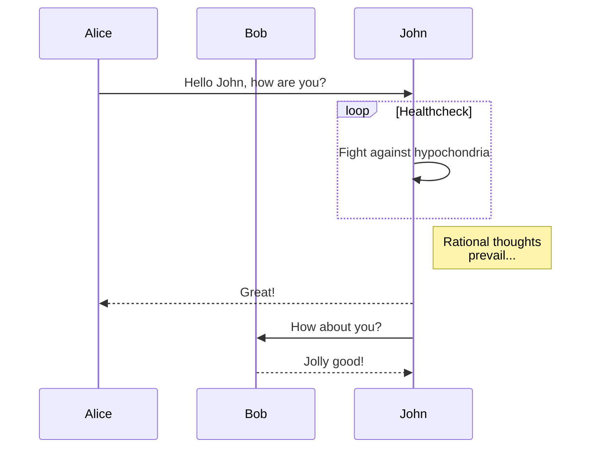
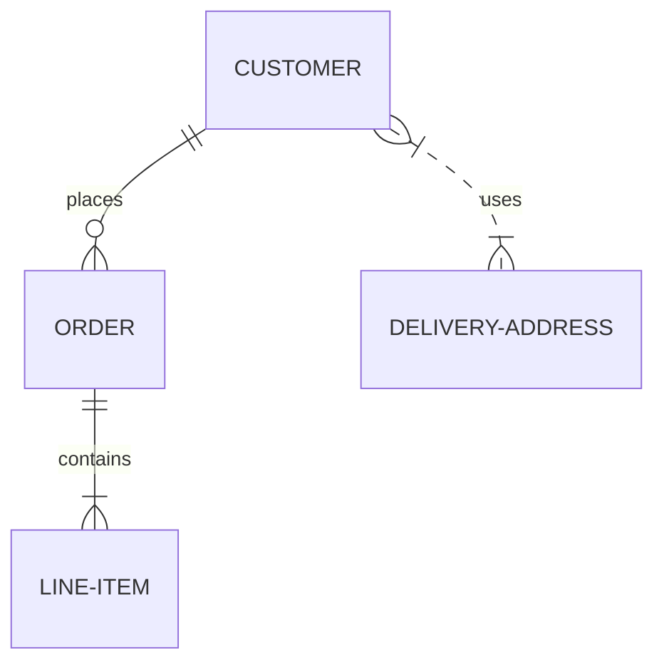
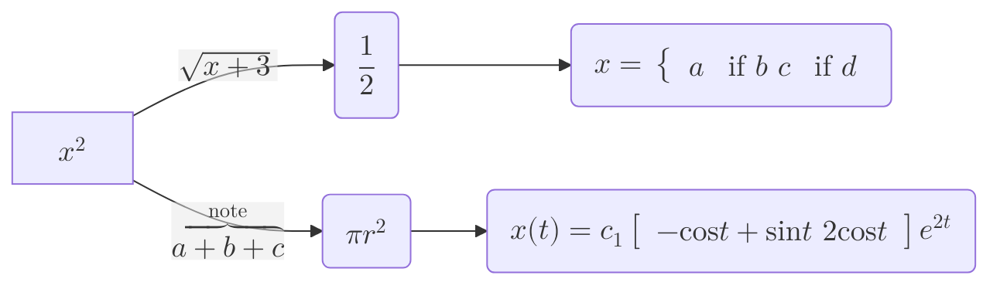
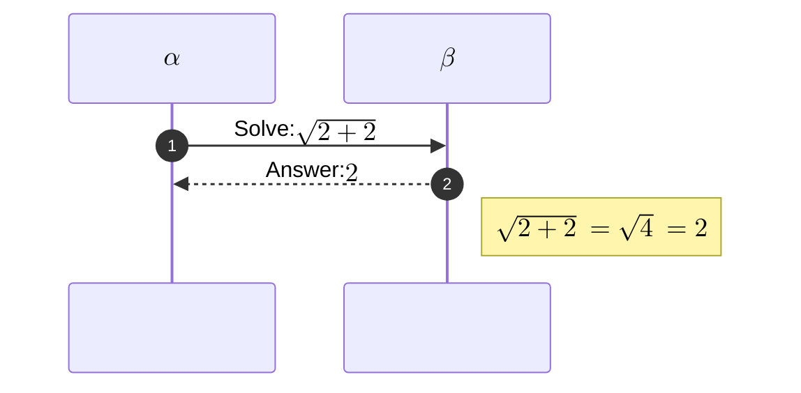

# Mermaid

[Mermaid](https://mermaid.js.org/syntax/sequenceDiagram.html){:target="_blank"} lets you create diagrams and visualizations using text and code.

## Table of Contents
{: .no_toc .text-delta }

1. TOC
{:toc}

## Graph

## Sequence Diagram

## ER Diagram

## Maths

